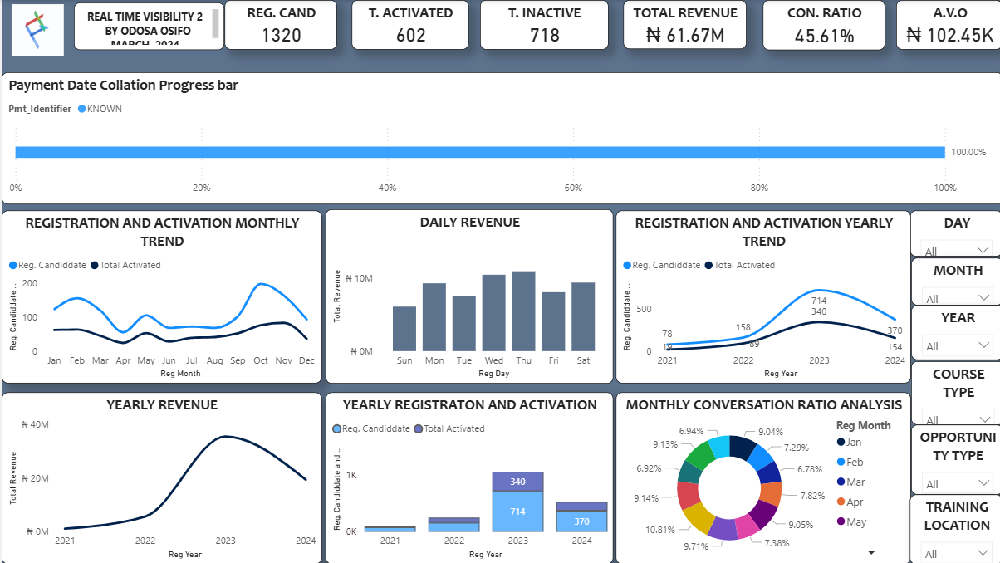

# Data Analytics Portfolio

# Project 1

**Title:** [Customer Shopping Behaviour for USA](https://github.com/odosa-osifo/odosa-osifo.github.io/blob/main/Shopping_behavior(Portfolio).xlsx)

**Tools Used:** Microsoft Excel(Pivot Tables, Pivot charts, slicers, functions, Power query editor, conditional formating, text-box)

**Introduction:**
This project was undertaken to examine customer shopping behaviour in the USA and uncover actionable insights into purchasing patterns across demographics, product categories, and consumer preferences. 

The objective was to leverage data analytics techniques to support informed decision-making in areas such as marketing strategy, customer segmentation, and product optimisation.

**Project Description:** 
This project involved analysing customer shopping behaviour data to identify patterns and trends in purchasing activity across different demographic groups, product categories, and shopping preferences. The objective of the analysis was to generate insights that could help businesses better understand customer behaviour, improve marketing strategies, and optimise product offerings.

An interactive Excel dashboard was developed to provide a clear and comprehensive overview of key customer and sales metrics. The dashboard enables stakeholders to easily explore purchasing trends and evaluate performance across multiple dimensions such as customer demographics, product categories, and purchasing habits.

The dashboard includes the following features:

Purchase Amount by Product Category
Visualisation of total spending across different product categories to highlight which product groups generate the most revenue.

Customer Distribution by Gender and Age
Breakdown of customers by demographic groups to understand key customer segments and their purchasing patterns.

Purchase Trends by Season
Analysis of how purchasing behaviour changes across seasons, helping identify potential seasonal demand patterns.

Payment Method Analysis
Overview of the most commonly used payment methods, providing insight into customer payment preferences.

Customer Engagement Indicators
Metrics such as review ratings, subscription status, and purchase frequency to evaluate customer engagement and loyalty.

Geographical Insights
Analysis of purchase activity by location to identify high-performing regions.

Additionally, the dashboard includes interactive slicers that allow users to dynamically filter the data by:

Gender, Product Category, Season, Payment Method, Subscription Status

These filters allow stakeholders to drill down into specific customer segments and gain deeper insights into shopping behaviour.

**Key Findings:** 
CATEGORY PREFERENCE BY GENDER														
1. Male customers dominate purchases across all categories (Accessories, Clothing, Footwear, Outerwear).														
														
2. Female participation is consistent but significantly lower in every category.														
														
📌 Insight: Marketing campaigns could be gender-segmented—male-focused promotions may yield faster ROI, while female-targeted campaigns represent a growth opportunity.														

---

PROMO CODE USAGE														
1. About 57% of customers did NOT use promo codes																												
2. 43% used promo codes, which is still a sizeable segment.														
														
📌 Insight: Customers are willing to purchase without discounts, indicating strong product value. Promo codes can be strategically targeted instead of mass-distributed to protect margins.														

---
														
TOP PERFORMING REGION														
1. Montana leads as the highest-selling region.  Followed by illinois and California																												
2. Nevada shows the lowest sales among the top 5.														
														
📌 Insight: Regional demand varies significantly—high-performing regions are ideal for inventory expansion, while low-performing regions may need localized marketing or pricing strategies.														

---
														
PURCHASE FREQUENCY PATTERNS														
1. Every 3 Months is the most common purchase cycle.														
														
2. Annually and Quarterly also show strong engagement.														
														
3. Weekly purchases are the lowest, indicating this is not a high-frequency shopping category.														
														
📌 Insight: The business aligns more with planned or need-based shopping, not impulse buying. Subscription models or reminder-based campaigns could increase frequency.														

---
														
PAYMENT METHOD PREFERENCES														
1. Credit Card and PayPal are the most used payment methods.														
														
2. Cash also shows strong usage.														
														
3. Venmo and Bank Transfer trail behind.														
														
📌 Insight: Customers prefer secure and convenient digital payment methods. Optimizing checkout UX for cards and PayPal can reduce cart abandonment

---

CATEGORY PREFERENCE BY GENDER														
1. Male customers dominate purchases across all categories (Accessories, Clothing, Footwear, Outerwear).														
														
2. Female participation is consistent but significantly lower in every category.														
														
📌 Insight: Marketing campaigns could be gender-segmented—male-focused promotions may yield faster ROI, while female-targeted campaigns represent a growth opportunity.														

---
														
PROMO CODE USAGE														
1. About 57% of customers did NOT use promo codes														
														
2. 43% used promo codes, which is still a sizeable segment.														
														
📌 Insight: Customers are willing to purchase without discounts, indicating strong product value. Promo codes can be strategically targeted instead of mass-distributed to protect margins.														

---
														
TOP PERFORMING REGION														
1. Montana leads as the highest-selling region.  Followed by illinois and California																												
2. Nevada shows the lowest sales among the top 5.														
														
📌 Insight: Regional demand varies significantly—high-performing regions are ideal for inventory expansion, while low-performing regions may need localized marketing or pricing strategies.														

---
														
PURCHASE FREQUENCY PATTERNS														
1. Every 3 Months is the most common purchase cycle.														
														
2. Annually and Quarterly also show strong engagement.														
														
3. Weekly purchases are the lowest, indicating this is not a high-frequency shopping category.														
														
📌 Insight: The business aligns more with planned or need-based shopping, not impulse buying. Subscription models or reminder-based campaigns could increase frequency.														

---
														
PAYMENT METHOD PREFERENCES														
1. Credit Card and PayPal are the most used payment methods.														
														
2. Cash also shows strong usage.														
														
3. Venmo and Bank Transfer trail behind.														
														
📌 Insight: Customers prefer secure and convenient digital payment methods. Optimizing checkout UX for cards and PayPal can reduce cart abandonment														

**Dashboard Overview:**
.png)

# Project 2

**Title:** SQL Data Definition and Manipulation Language - Sales Data

**SQL Code:** [Sales Data](https://github.com/odosa-osifo/odosa-osifo.github.io/blob/main/Sales_Data.sql)

**SQL Skills Used:** This project demonstrates the use of SQL queries to retrieve, manipulate, and analyze employee data from a relational database. The queries were designed to extract meaningful information, transform text data, and perform basic aggregation to support data analysis tasks.

The project includes the following SQL operations:

Data Retrieval (SELECT)
Extracted specific columns from the database, such as employee names and department information, to retrieve relevant records for analysis.

Text Transformation (UPPER, LEFT)
Applied string functions to manipulate textual data, including converting employee names to uppercase and extracting the first four characters of employee names for formatting and analysis purposes.

Data Aggregation (COUNT)
Calculated the number of employees within specific departments (e.g., HR) to generate summary insights about workforce distribution.

Date Functions (GETDATE)
Retrieved the current system date using SQL date functions to demonstrate dynamic date handling within queries.

SQL Joins (LEFT, INNER)
Joined data from multiple tables using unique identifiers to link tables and performed filtering and analysis

String Parsing (CHARINDEX)
Extracted location names from the address column by identifying and isolating text that appears before brackets, enabling cleaner geographic data representation.

Database Structure Management (CREATE TABLE)
Created a new table by defining its structure to support additional data storage and database organization.

Data Filtering (WHERE)
Applied conditional filtering to retrieve only relevant records, such as employees belonging to a specific department.

**Project Description:** This project demonstrates the use of SQL for data querying, transformation, and analysis using an employee dataset. The objective of the project was to explore how SQL can be used to efficiently retrieve and manipulate structured data stored in a relational database.

Through a series of SQL queries, key information was extracted from the employee dataset to perform tasks such as data formatting, aggregation, and filtering. The project highlights common SQL operations that are widely used in data analysis and database management.

The queries performed in this project include retrieving employee information, transforming text data, calculating department-level summaries, extracting specific elements from string fields, and generating system date values. These operations demonstrate practical applications of SQL functions for handling real-world business data.

Additionally, the project includes database structure management by creating new tables to support data organization and storage.

Overall, this project showcases fundamental SQL skills including data retrieval, string manipulation, aggregation, filtering, and database management, which are essential for data analysts and data scientists working with relational databases.

**Technology Used:** SQL server

# Project 3

**Title:** [Cancer Data Analysis](https://github.com/odosa-osifo/odosa-osifo.github.io/blob/main/Cancer%20Data%20Analysis%20(Portfolio).pbix)

**Tools Used:** Power BI (Data Modelling, DAX, Power Query, Interactive Visualisations, Slicers, Data Quality)

**Project Description:**  
This project focuses on analysing cancer patient data to uncover critical insights into patient demographics, treatment patterns, survival outcomes, and regional distribution of cases. The goal of the analysis is to support healthcare decision-making by identifying trends that can improve treatment strategies, resource allocation, and patient outcomes.

An interactive Power BI dashboard was developed to provide a comprehensive overview of key clinical and demographic indicators. The dashboard enables users to explore patient data dynamically across multiple dimensions such as cancer stage, gender, smoking status, and diagnosis timelines.

The dashboard includes the following features:

Cancer Stage Distribution  
Breakdown of patients across different cancer stages (I–IV) to highlight disease progression trends.

Patient Demographics  
Analysis of gender distribution and smoking status to identify potential risk factors.

Survival Analysis  
Visual representation of survival outcomes, showing the proportion of patients who survived versus those who did not.

Regional Case Distribution  
Identification of top provinces with the highest number of cancer cases to support geographic resource planning.

Treatment Insights  
Average chemotherapy sessions and surgery trends over time to evaluate treatment intensity and healthcare demand.

Time-Based Analysis  
Monthly trend of surgeries to understand fluctuations in treatment activity over time.

Interactive Filtering  
Slicers for smoking status, gender, and diagnosis date allow users to drill down into specific patient groups for deeper analysis.

**Key Findings:**

CANCER STAGE DISTRIBUTION  
1. The majority of patients are diagnosed at Stage II and Stage III.  
2. Stage IV cases are significantly lower but still clinically critical.  

📌 Insight: Late-stage diagnosis (Stage II & III dominance) suggests gaps in early detection and screening programs. Increasing early diagnosis initiatives could significantly improve survival rates.

---

SURVIVAL OUTCOMES  
1. Approximately 79% of patients are alive, while 21% are deceased.  

📌 Insight: While survival rates appear relatively high, the mortality proportion is still significant. Further analysis into treatment effectiveness and early intervention strategies could help reduce fatalities.

---

REGIONAL DISTRIBUTION  
1. Guangdong has the highest(184) number of cancer cases.  
2. Other high-burden regions include Shandong and Sichuan.  

📌 Insight: Cancer cases are geographically concentrated, indicating the need for region-specific healthcare resource allocation and targeted intervention programs.

---

TREATMENT PATTERNS  
1. The average chemotherapy session per patient is approximately 2.8.  
2. Surgery trends fluctuate across months, with noticeable peaks(May) and dips(November).  

📌 Insight: Variability in treatment patterns may indicate differences in treatment accessibility, patient condition severity, or hospital capacity. This highlights the need for more consistent treatment planning.

---

RISK FACTOR ANALYSIS (SMOKING & GENDER)  
1. Smoking status segmentation shows variation across patient groups.  
2. Gender distribution indicates differences in cancer occurrence between male and female patients.  

📌 Insight: Lifestyle factors such as smoking remain a critical variable in cancer analysis. Preventative health campaigns targeting high-risk groups could reduce incidence rates.

---

TIME-BASED TRENDS  
1. Surgery counts show inconsistent patterns throughout the year.  

📌 Insight: Seasonal or operational factors may influence treatment volumes. Understanding these patterns can help optimize hospital staffing and resource planning.

---

**Technology Used:** Microsoft Power BI

**Dashboard Overview:**  

## Project 4

**Title:** [Customer Registration, Activation & Revenue Performance Analysis](https://github.com/odosa-osifo/odosa-osifo.github.io/blob/main/Customer%20Registration%2C%20Activation%20%26%20Revenue%20Performance%20Analysis.pbix)

**Tools Used:** Power BI (DAX, Data Modelling, Power Query, Interactive Dashboards, KPI Cards, Slicers)

**Project Description:**  
This project focuses on analysing customer lifecycle performance, from registration through activation to revenue generation. The objective is to identify key trends in customer acquisition, conversion efficiency, and revenue performance to support data-driven business decisions.

An interactive Power BI dashboard was developed to monitor key performance indicators such as total registrations, activations, conversion ratio, revenue trends, and average order value. The dashboard enables stakeholders to evaluate operational performance across time (daily, monthly, yearly) and identify opportunities for growth and optimisation.

The dashboard includes the following features:

KPI Overview  
Summary metrics including total registered candidates, activated users, inactive users, total revenue, conversion ratio, and average order value.

Registration & Activation Trends  
Monthly and yearly analysis of customer acquisition and activation patterns.

Revenue Analysis  
Breakdown of revenue performance across days and years to identify peak revenue periods.

Conversion Funnel Insights  
Comparison of registered vs activated users to evaluate conversion efficiency.

Conversation Ratio Analysis  
Monthly breakdown of conversion rates to identify fluctuations in performance.

Interactive Filters  
Dynamic filtering by day, month, year, course type, opportunity type, and training location for deeper analysis.

---

**Key Findings:**

CUSTOMER ACQUISITION & CONVERSION  
1. Total registered candidates (1320) significantly exceed activated users (602), resulting in a conversion ratio of 45.61%.  
2. A large portion of users (718) remain inactive after registration.  

📌 Insight: There is a clear drop-off between registration and activation, indicating friction in the onboarding or conversion process. Optimising user onboarding and engagement strategies could significantly improve activation rates.

---

REVENUE PERFORMANCE  
1. Total revenue generated is ₦61.67M, with an average order value of ₦102.45K.  
2. Revenue peaks mid-week (Wednesday–Thursday), with relatively lower performance on Sundays.  

📌 Insight: Mid-week periods drive the highest revenue, suggesting optimal timing for campaigns and promotions. Weekend engagement strategies may need improvement to balance revenue distribution.

---

YEARLY GROWTH TREND  
1. Revenue experienced significant growth from 2021 to 2023, peaking at approximately ₦35M in 2023.  
2. A decline is observed in 2024 revenue performance.  

📌 Insight: The drop in 2024 suggests potential market saturation, reduced demand, or operational inefficiencies. This signals a need for strategic intervention to sustain growth.

---

REGISTRATION & ACTIVATION TRENDS  
1. Both registrations and activations peaked in 2023.  
2. A decline is visible in 2024 across both metrics.  

📌 Insight: The decline in both acquisition and activation suggests a broader business slowdown rather than just a conversion issue. Marketing and acquisition strategies may need to be re-evaluated.

---

MONTHLY PERFORMANCE PATTERNS  
1. Registration and activation trends show fluctuations throughout the year, with peaks around October.  
2. Early months and mid-year periods show relatively lower activity.  

📌 Insight: There are strong seasonal patterns in user engagement. Businesses can capitalise on high-performing months and implement targeted campaigns during low periods.

---

CONVERSION RATE VARIABILITY  
1. Monthly conversion ratios fluctuate between approximately 6.7% and 10.8%.  

📌 Insight: Inconsistent conversion rates indicate variability in campaign effectiveness or user experience. Standardising best-performing strategies could stabilise and improve overall conversion performance.

---

DATA QUALITY INDICATOR  
1. Payment data shows 100% completion (no missing payment identifiers).  

📌 Insight: High data completeness ensures reliable financial analysis and indicates strong data collection processes.

---

**Technology Used:** Microsoft Power BI

**Dashboard Overview:**  

<h2> 🤳 Connect with me:</h2>

[][linkedin]

[linkedin]: https://linkedin.com/in/odosa-osifo-47784a194

<!--
**odosa-osifo/odosa-osifo** is a ✨ _special_ ✨ repository because its `README.md` (this file) appears on your GitHub profile.

Here are some ideas to get you started:

- 🔭 I’m currently working on ...
- 🌱 I’m currently learning ...
- 👯 I’m looking to collaborate on ...
- 🤔 I’m looking for help with ...
- 💬 Ask me about ...
- 📫 How to reach me: ...
- 😄 Pronouns: ...
- ⚡ Fun fact: ...
-->
